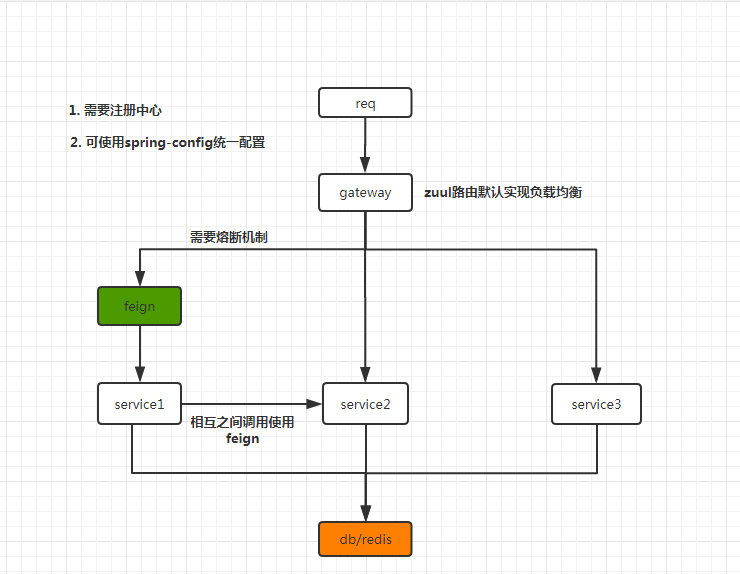

# ms-project

Spring cloud 的微服务架构使用.

---

## 1. 模块说明

### 1.1 架构图

项目架构简略图如下所示



### 1.2 模块简介


| 模块名称   | 功能说明               | 默认端口 | 备注 |
| ---------- | ---------------------- | :------: | ---- |
| ms-reg     | 注册中心模块           |   5100   | -    |
| ms-service | 服务提供者模块         |   5200   | -    |
| ms-gateway | 路由模块               |   5500   | -    |
| ms-config  | 统一配置 server 模块   |   5300   | -    |
| ms-caller  | feign 负载均衡调用模块 |   5400   | -    |

---

## 2. 启动流程


### 2.1 开启流程

请遵循如下开启顺序: **ms-reg -> ms-config -> ms-service -> ms-caller -> ms-gateway.**

ms-config 的配置 git 上面的文件有: `ms-auth.properties`,`ms-auth-dev.properties`,`ms-service.properties`,`ms-service-dev.properties`.

四个文件的内容请参考`docs/`文件夹里面的文件.

项目默认使用的配置文件为: `spring.application.name`+`spring.profiles.active`+`properties/yml`.


### 2.2 动态路由数据库脚本

```sql
DROP TABLE IF EXISTS `gateway_api_t`;
CREATE TABLE `gateway_api_t` (
  `id` varchar(50) NOT NULL,
  `path` varchar(255) NOT NULL,
  `service_id` varchar(50) DEFAULT NULL,
  `url` varchar(255) DEFAULT NULL,
  `retryable` tinyint(1) DEFAULT NULL,
  `enabled` tinyint(1) NOT NULL,
  `strip_prefix` int(11) DEFAULT NULL,
  `api_name` varchar(255) DEFAULT NULL,
  PRIMARY KEY (`id`)
) ENGINE=InnoDB DEFAULT CHARSET=utf8;

-- ----------------------------
-- Records of gateway_api_t
-- ----------------------------
INSERT INTO `gateway_api_t` VALUES ('ms-feign', '/feign/**', 'ms-feign', null, '0', '1', '1', null);
INSERT INTO `gateway_api_t` VALUES ('ms-service', '/service/**', 'ms-service', null, '0', '1', '1', null);
```
---

## 3. 其他

如有疑问,请联系: `cs12110@163.com`.

---

## 4. 参考资料

a. [开源项目pig](https://gitee.com/log4j/pig)

b. [spring cloud博客](https://blog.csdn.net/forezp/article/details/70148833)